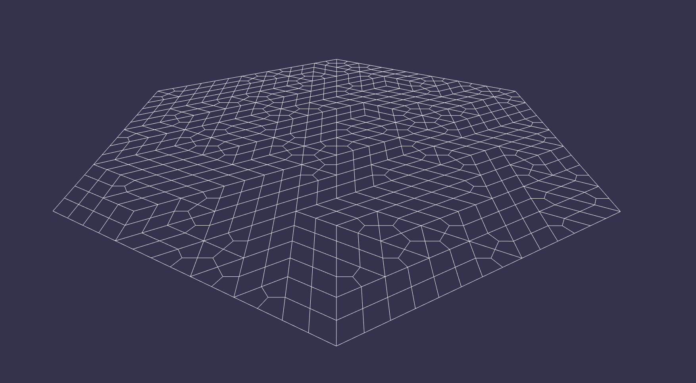

# hexgrid-relax
Simple Electron.JS and Babylon.JS Hexgrid relaxation implementation

*Inspiration from [Oskar Stålberg](https://twitter.com/OskSta) and his upcoming game*
<blockquote class="twitter-tweet">
In code, these are called &quot;Italian Wires&quot; <a href="https://t.co/R16K3SoFxQ">pic.twitter.com/R16K3SoFxQ</a>
  </img>
&mdash; Oskar Stålberg (@OskSta) <a href="https://twitter.com/OskSta/status/1259838941299183619?ref_src=twsrc%5Etfw">May 11, 2020</a></blockquote>

*Code inspired by [Kevin Chapelier](https://github.com/kchapelier)*

